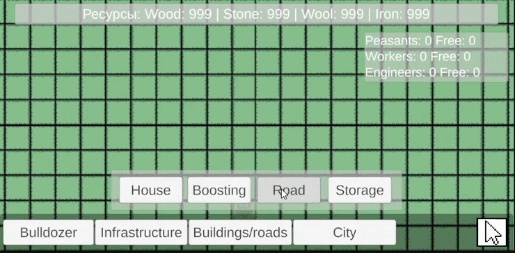
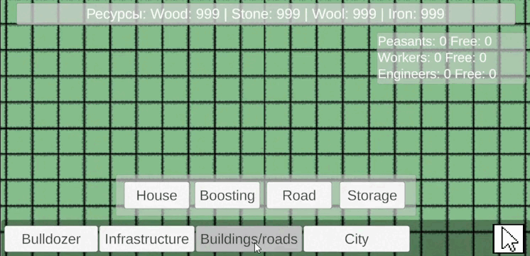
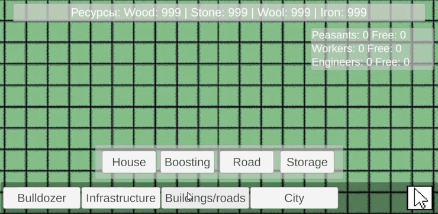

# 👾 Urbanistics

**A game about building a city on Unity**.

## 🎮 Unity Game

**Urbanistics** — This is a single-player urban strategy game set in a medieval setting.
The player builds buildings, extracts resources, manages the inhabitants (peasants → workers → engineers), develops the economy and maintains the comfort of the townspeople through bars and markets.

## 🕹️ Basic Mechanics

-	Grid-based building construction

-	Resource extraction (wood, stone, food)

-	Population management: houses are populated depending on comfort

-	Home improvement (peasants → workers → engineers)

-	Autonomous operation of buildings in the presence of employees

-	Trade: exchange of resources on the market

## **Gameplay demo:**

## **Trading system:**

## **Modes:**

## ⚙️ Controls

- LBM — select/build a building

- RBM — cancel construction

- MMB — moving the camera

- Mouse wheel — zoom

## 🚀 Project launch

1. Install Unity 6000.1.6
2. Clone the repository: git clone https://github.com/dmitrykaras/Urbanistics
3. Open the project folder in Unity Hub
4. Press Play to launch

## 📂 Project structure
<pre>
📁 Assets
 ├── 📜 Scripts/      # C# Scripts (PopulationManager, ResourceManager, etc.)
 ├── 🏠 Prefabs/      # Buildings
 ├── 🎨 Sprites/      # Sprites (buildings, UI, etc.)
 ├── 🖥️ UI/           # Interface (HUD, menu, panels)
 └── 🎲 Scenes/          # The main scenes of the game
  </pre>
 
## ✅ Development status

- ✅ Basic construction Mechanics

- ✅ Resource system

- ✅ Population and comfort

- ✅ Home boosting

- ⬚ Balancing the economy

- ⬚ Final animations and UI

## 📌 Project objectives
- Create a prototype of the game in 3-4 months

- Demonstrate the skills of game design and development on Unity

- Use the project as a pet project for a portfolio

## 🔊 Sound
- Background music

- Sounds of construction

## 🦾 Technologies
- **Unity**
- **C#**

## 👥 The authors

- **dmitrykaras**(https://github.com/dmitrykaras)

## 🎫 License

This project is licensed under the MIT License - see the [LICENSE](LICENSE) file for details.

